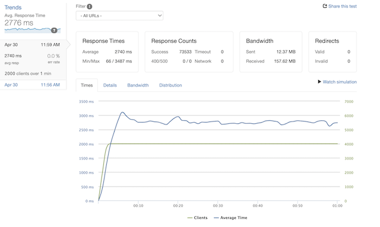
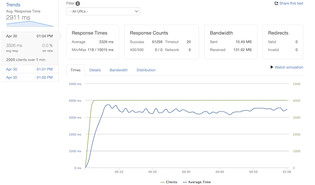
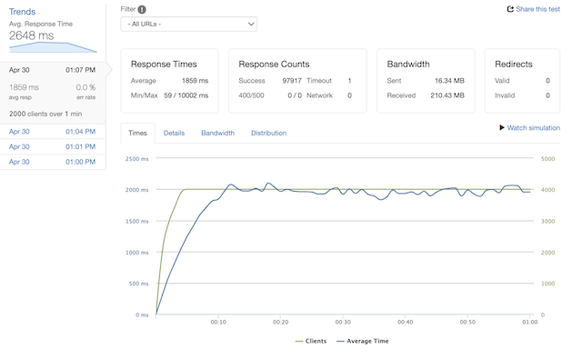
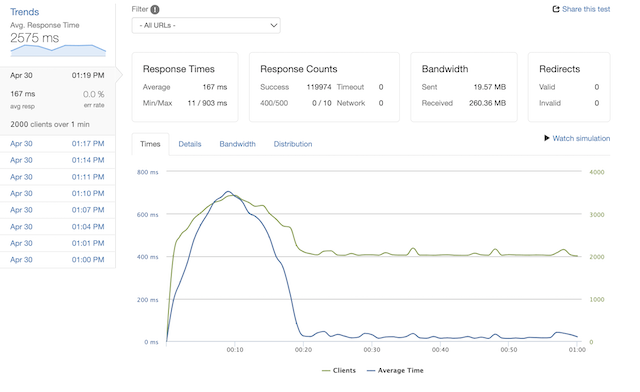

# Atelier Reviews API Service

Goal: Build a scalable REST API for a retail e-commerce front-end, optimized to handle web-scale traffic.

- Implemented an ETL process to migrate over 7GB into a redesigned postreSQL database optimizing query times to ~1ms.
- Scaled horizontally to a micro-service architecture with 3 AWS EC2 instances.
- Installed an NGINX load balancer to distribute traffic across servers and utilize proxy_caching.

## Load Testing
### *Scenario*
#### Randomized selections from bottom 20% of dataset @ 2000RPS

| Optimization                      | Avg. Response Time | Successful Response Count |
|-----------------------------------|--------------------|---------------------------|
| None                              | 2740ms             |  73533/120000             |
| (1) EC2 w/ NGINX Load Balancer    | 3326ms             |  61298/120000             |
| (2) EC2 w/ NGINX Load Balancer    | 1859ms             |  97917/120000             |
| (3) EC2 w/ NGINX Load Balancer    | 1609ms             | 107589/120000             |
| NGINX Tuned w/ proxy_caching      | 167ms              | 119974/120000             |

Optimization 1

 

Optimization 2

 

Optimization 3

 

Optimization 4

 

Optimization 5

 

### *Scenario*
#### Randomized selections from 0-500K rows of dataset @ 1000RPS

| Optimization                      | Avg. Response Time | Successful Response Count |
|-----------------------------------|--------------------|---------------------------|
| 1 EC w/o Load Balancer            | 3923ms             | 46508/120000              |
| (1) EC2 w/ NGINX Load Balancer    | 3688ms             | 55455/120000              |
| (2) EC2 w/ NGINX Load Balancer    | 3541ms             | 55794/120000              |
| (3) EC2 w/ NGINX Load Balancer    | 18ms               | 60000/120000              |
| (3) EC2 w/ NGINX Load Balancer    | 18ms               | 59996/60000               |
