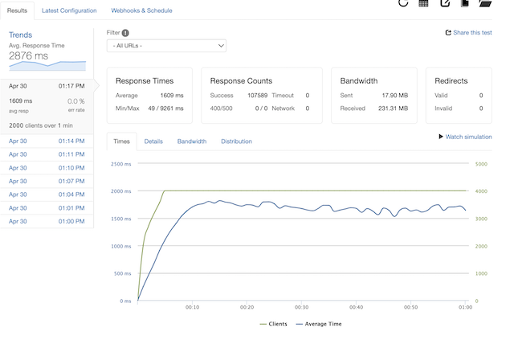

  

<br>

# Atelier Reviews API Service

Starting with a sluggish API capable of less than 100RPS, the Atelier Reviews API is the result of refactoring an e-commerce monolithic application to a more performant and scalable microservice architecture capable of handling webscale traffic.


### *Optimizations:*
- Implemented an ETL process to migrate over 7GB/20M+ entries into a redesigned postreSQL database optimizing query times to ~1ms.
- Scaled horizontally to a microservice architecture with 3 AWS EC2 instances.
- Utilized an NGINX load balancer to distribute traffic across servers and take advantage of caching capabilities.

<br>

## Stress Testing
### *Scenario*
#### Randomized selections from bottom 20% of dataset @ 2000RPS
##### *93% Decrease in Avg. response time with 163% increase in successful responses*
<br>


| Optimization                      | Avg. Response Time | Successful Response Count |
|-----------------------------------|--------------------|---------------------------|
| Single server w/ PostgreSQL on AWS| 2740ms             |  73533 / 120000           |
| (1) EC2 w/ NGINX Load Balancer    | 3326ms             |  61298 / 120000           |
| (2) EC2 w/ NGINX Load Balancer    | 1859ms             |  97917 / 120000           |
| (3) EC2 w/ NGINX Load Balancer    | 1609ms             | 107589 / 120000           |
| Optimized database & NGINX        | 167ms              | 119974 / 120000           |
| Optimized caching                 | 48ms               | 119979 / 120000           |


### *Loader.io*

<details>
<summary>Test 1</summary>
<br>


</details>

<details>
<summary>Test 2</summary>
<br>


</details>

<details>
<summary>Test 3</summary>
<br>


</details>

<details>
<summary>Test 4</summary>
<br>



</details>

<details>
<summary>Test 5</summary>
<br>


</details>

<details>
<summary>Test 6</summary>
<br>


</details>

<br>

## Getting Started
1. From a terminal, clone from [this repo](https://github.com/sdc-ice-climbers/ice-climbers-reviews-api)
```
git clone https://github.com/sdc-ice-climbers/ice-climbers-reviews-api.git
```
2. install dependencies
```
npm install
```
3. Configure your .env file (see example.env).
4. Follow schemas in the ELT Scripts [PostgreSQL Schema](https://github.com/sdc-ice-climbers/ice-climbers-reviews-api/blob/main/db/schema_ETL/ETL.sql) to set up the database.
5. Start up server
```
npm run server-prod
```
<br>

## Routes

| HTTP Request | API Endpoint                | Response                                                                   | Status Codes|
|--------------|-----------------------------|----------------------------------------------------------------------------|:--------:|
| GET          | /reviews/:product_id        | A list of reviews per particular product                                   | 200    |
| GET          | /reviews/meta/:product_id   | Metadata for a single product                                              | 200    |
| POST         | /reviews/:product_id        | Post review for a given product                                            | 200    |
| PUT          | /reviews/helpful/:review_id | Mark review helpful                                                        | 200    |
| PUT          | /reviews/report/:review_id  | Report review                                                              | 200    |

---
